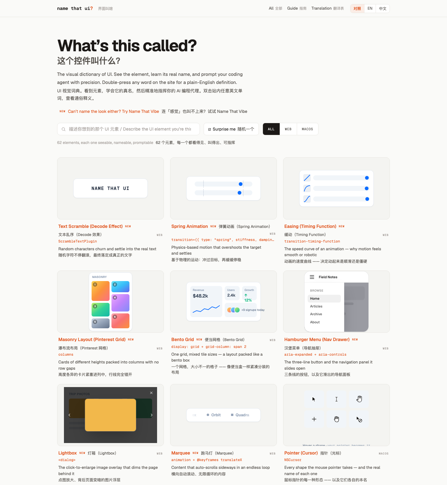
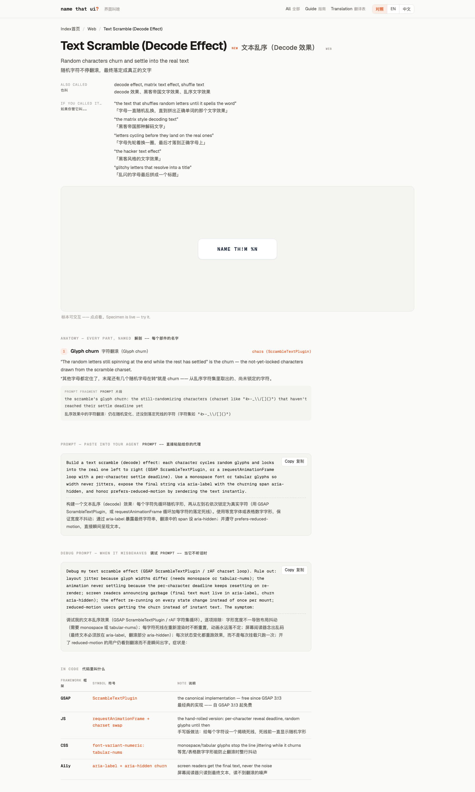
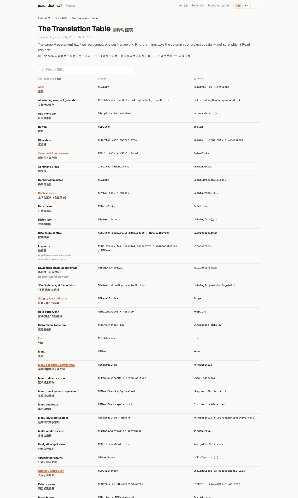

# Learn UI Name · 界面叫啥

**中文** | [English](#english)



> UI 视觉词典的中英双语对照版：看到元素，学会它的真名（Web CSS/ARIA + macOS AppKit/SwiftUI），认出风格，学会它的学名，然后精准地指挥你的 AI 编程代理。
> A bilingual (EN/中文) visual dictionary of UI: see it, name it, and prompt your coding agent with precision.

[在线演示 Live Demo](https://learnui.qiaomu.ai/) · [风格图鉴 Name That Vibe](https://learnui.qiaomu.ai/styles/) · [词条示例](https://learnui.qiaomu.ai/web/text-scramble/) · [翻译对照表](https://learnui.qiaomu.ai/guides/translate/)

**已验证：** 81 个静态页面零 JS 错误；62 个 UI 标本 + 14 个风格标本全部真实渲染；搜索/筛选/双语切换/复制/查词交互通过；移动端无横向溢出；`python3 build.py` 一条命令重建全站。

## 这是什么

[namethatui.com](https://namethatui.com/) 的**完整内容复刻 + 中英双语对照版**，为学习目的而建。原站是「UI 视觉词典」——每个词条给出一个活的界面标本、它的正式名称、一句人话解释，和一段可以直接喂给 AI 编程代理的 prompt。它的子站 **Name That Vibe**（`/styles`）是「视觉风格图鉴」——每种风格给出标本、3–8 条定义性信号（style DNA）、和一段可粘贴的风格 brief。

本站保留原站全部内容，并为每一段英文配上中文对照：

- **62 个词条**：31 个 Web + 31 个 macOS，每个都有可交互的活体标本（不是截图，是真 HTML/CSS/JS）
- **62 个详情页**：解剖（每个部件的名字）、Prompt、调试 Prompt、代码符号表、相关词条
- **14 种视觉风格**：Skeuomorphism、Liquid Glass、Neubrutalism、Y2K、Frutiger Aero、Aqua…… 每种含风格标本、完整 style DNA（定义性/辅助/可变/避免信号）、易混淆风格对比、代码起点、可复制的风格 brief
- **3 篇指南**：AppKit vs SwiftUI、Swift vs Electron、翻译对照表（63 条 plain name → AppKit → SwiftUI）
- **三种阅读模式**：中英对照（默认）/ 纯英文 / 纯中文，页眉一键切换
- **全站搜索**：中英文模糊描述都能搜（试试「三个点」「mac 窗口按钮」），`/` 或 `⌘K` 聚焦、Esc 清空、匹配高亮、`?q=` 深链
- **双击查词**：双击任意英文单词，弹出通俗英文释义
- **一键复制**：Prompt、调试 Prompt、风格 brief、代码片段、整页 Markdown
- **PWA**：可安装到主屏，离线可读（service worker 缓存）

## 为什么值得用

给 AI 编程代理写 prompt 时，最大的损耗是「那个东西叫什么」。知道 *scrim*、*disclosure triangle*、*liquid glass* 这些真名，代理一次就能改对地方。双语对照让中文读者不用再猜英文术语对应什么。

## 页面巡游

| 词条详情页 | 翻译对照表 |
|---|---|
|  |  |

## 快速开始

纯静态站点，无框架、无依赖、Python 标准库构建：

```bash
git clone https://github.com/joeseesun/learnui.git
cd learnui
python3 build.py          # 生成 site/（81 页）
cd site && python3 -m http.server 8000
# 打开 http://127.0.0.1:8000/
```

改内容：编辑 `data/*.json`（英文源数据）、`data/zh/*.json`（中文译文）、`demos/<slug>.html`（标本），再跑 `python3 build.py`。

## 项目结构

```
learnui/
├── build.py            # 静态站点生成器（Python 标准库，无依赖）
├── data/
│   ├── entries.json    # 62 词条英文源数据（复刻自 namethatui.com）
│   ├── styles.json     # 14 视觉风格英文源数据（复刻自 /styles）
│   ├── styles-meta.json# 风格图鉴首页文案
│   ├── zh/             # 中文译文（条目/风格/指南/翻译表）
│   ├── guides.json     # 指南页结构化内容
│   ├── translate-table.json  # 63 行 AppKit/SwiftUI 对照
│   └── ui.json         # 站点文案（双语）
├── demos/<slug>.html   # 62 个 UI 标本 + 14 个 style-<slug>.html 风格标本
├── assets/             # site.css / site.js / 自托管 Geist 字体 / PWA 图标
├── manifest.webmanifest + sw.js  # PWA（构建时注入版本号）
├── DESIGN.md           # 设计系统锚点（Vercel 式黑白）
└── site/               # 构建产物（git 忽略，build.py 生成）
```

## 设计

「Vercel 式黑白」：纯白底、黑/灰阶、链接蓝 `#0070f3` 唯一功能色、Geist/Geist Mono 自托管字体、字重只用 400/500/600、发丝边框代替阴影。标本如实还原被模仿系统的外观（macOS Sonoma 观感、Aqua 糖果、Frutiger Aero 光泽……），站点 chrome 保持克制。完整设计约束见 [DESIGN.md](DESIGN.md)。

## 实测验证

- 全量 81 页 Playwright 巡检：无 JS 错误，标本均有真实渲染尺寸
- 交互测试：中英文搜索、平台筛选、语言三态切换、随机词条、剪贴板复制、翻译表过滤、灯箱开合，全部通过
- 移动端 390px 无横向溢出（翻译表独立横向滚动）
- 线上环境：<https://learnui.qiaomu.ai/> 200，HTTPS + HSTS，Umami 统计链路实测写入成功

## 限制与版权

- 英文源内容（`data/entries.json`、`data/guides.json`、`data/styles.json`）复刻自 [namethatui.com](https://namethatui.com/)，版权归原作者；本仓库代码（构建器、标本重实现、样式、译文）以 [MIT](LICENSE) 开源。
- 标本为学习目的的重新实现，不保证与原站像素级一致；原站如有更新，本站不会自动同步。
- 双击查词依赖 `dictionaryapi.dev` 的免费接口，网络不可用时优雅降级。

## 关于向阳乔木

- 网站：[qiaomu.ai](https://qiaomu.ai/) · 博客：[blog.qiaomu.ai](https://blog.qiaomu.ai/) · 工具推荐：[tuijian.qiaomu.ai](https://tuijian.qiaomu.ai/)
- X：[@vista8](https://x.com/vista8) · GitHub：[@joeseesun](https://github.com/joeseesun)
- 微信公众号：向阳乔木推荐看

---

<a name="english"></a>

# Learn UI Name — Bilingual (EN/中文) Visual Dictionary of UI

A faithful content replica of [namethatui.com](https://namethatui.com/) (including the **Name That Vibe** styles atlas) with full Chinese-English parallel text, built for learning. See a UI element or a visual style, learn its real name, and prompt your coding agent with precision.

**Live demo:** <https://learnui.qiaomu.ai/>

- **62 entries** (31 Web + 31 macOS), each with a **live interactive specimen** (real HTML/CSS/JS, not screenshots)
- **14 visual styles** (Skeuomorphism, Liquid Glass, Neobrutalism, Y2K, Frutiger Aero, Aqua…): style specimen, full style DNA signals, look-alike comparison, code starting points, copy-ready style brief
- **62 detail pages**: anatomy of every part, copy-ready agent prompt, debug prompt, API symbol table, related entries
- **3 guides**: AppKit vs SwiftUI, Swift vs Electron, and a 63-row Translation Table
- **3 reading modes**: bilingual (default) / English / 中文, persisted in localStorage
- **Full-text search** in English and Chinese (`/` or `⌘K` to focus, match highlighting, `?q=` deep links), **double-click any word** for a plain-English definition, **copy page as Markdown**
- **PWA**: installable, offline-readable

## Quick start

```bash
git clone https://github.com/joeseesun/learnui.git
cd learnui
python3 build.py          # builds site/ (81 pages, stdlib only)
cd site && python3 -m http.server 8000
```

Edit `data/*.json` (English source), `data/zh/*.json` (Chinese), or `demos/<slug>.html` (specimens), then rebuild.

## Verified

- All 81 pages load with zero JS errors; every specimen renders with real dimensions
- Interaction tests pass: EN/ZH search, platform filter, language modes, random entry, clipboard, table filter, lightbox
- No horizontal overflow at 390px; production site live with HTTPS + HSTS + Umami

## License & attribution

Code (builder, specimen reimplementations, styles, translations) is [MIT](LICENSE). English source content in `data/` is replicated from [namethatui.com](https://namethatui.com/) for learning purposes and remains © its original author.

Maintained by 向阳乔木 · [qiaomu.ai](https://qiaomu.ai/) · X [@vista8](https://x.com/vista8) · GitHub [@joeseesun](https://github.com/joeseesun)
